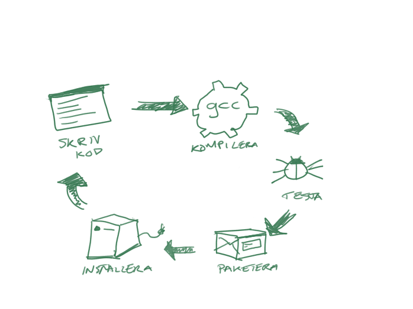
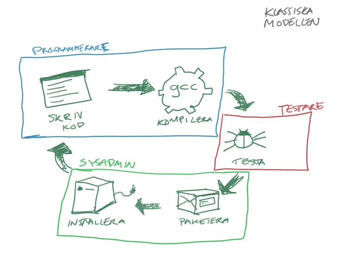
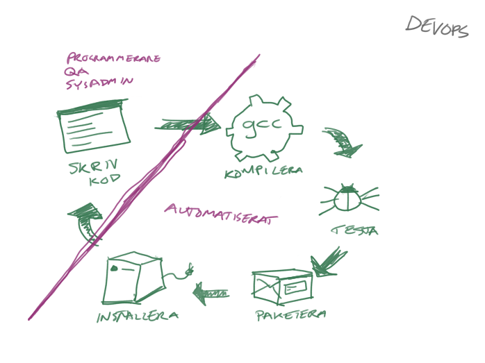
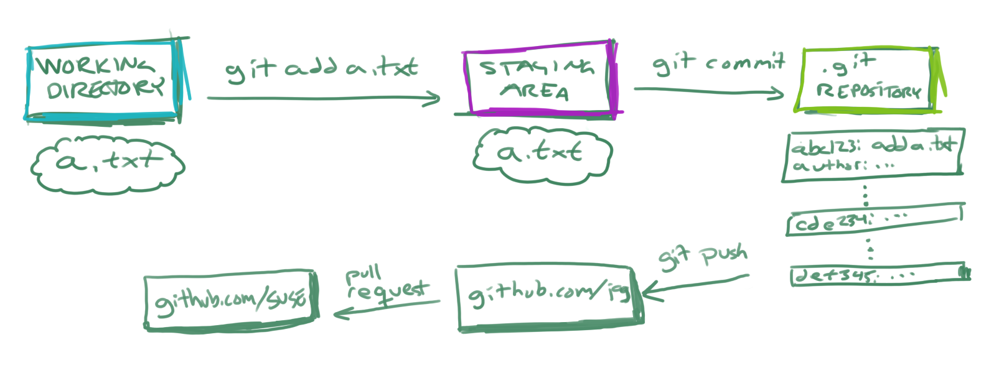
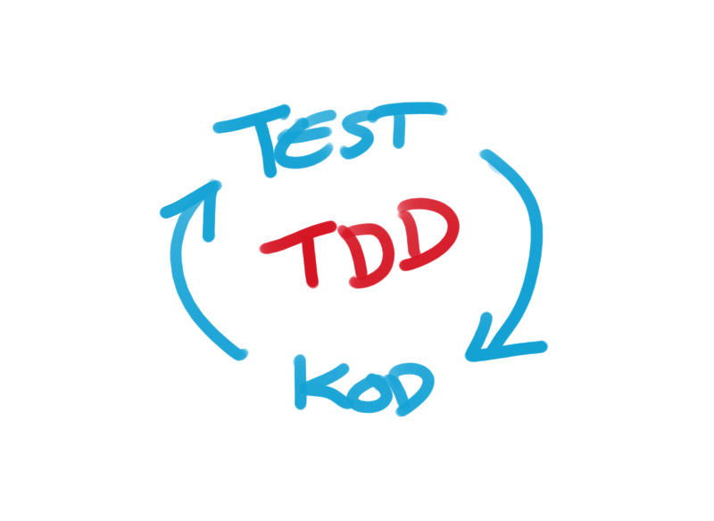
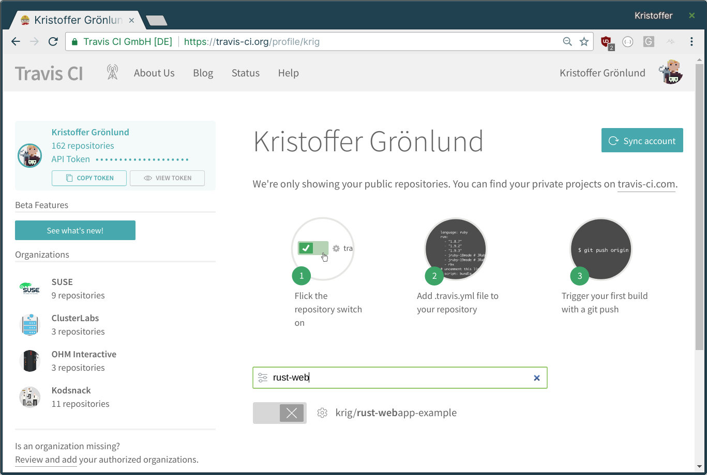
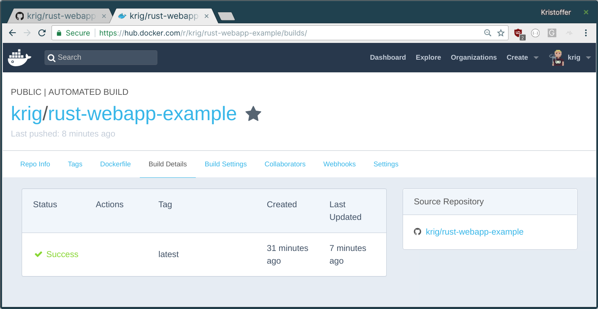

### Om Utveckling

<span id="tinyintro">`Kristoffer Grönlund, kgronlund@suse.com`</span>

---



--



--



--

Allt som är kod kan...

* ...dokumenteras
* ...testas
* ...versionshanteras
* ...delas
* ...osv.

--

> Så testare, sysadmins, osv. behövs inte längre?

Nej, tvärtom! Men test och infrastruktur är också kod.

--

Exempel: SUSE

``` text
1. ** skriver kod **
2. ** commit till github **
3. CI-systemet kompilerar och testar
4. OBS paketerar om test OK
5. OBS bygger ny systemversion
6. openQA installerar och testar
7. läggs ut som nästa version av tumbleweed om OK
8. (snapshot av tumbleweed -> nästa version av SLE)
```

--

Github: [github.com](https://github.com/)

Travis CI: [travis-ci.org](https://travis-ci.org/)

OBS: [build.opensuse.org](https://build.opensuse.org/)

openQA: [open.qa](http://open.qa/)


---

## Texteditor

--

* Syntax highlighting
* Felsökning
* Debugger
* Flexibilitet
* Programmerbarhet

--

[code.visualstudio.com](https://code.visualstudio.com/)

[vim.org](https://www.vim.org/)

[atom.io](https://atom.io/)

---

## Versionshantering

--

## `git`

--

``` sh
git init hello-world
cd hello-world
echo "hello" > README.md
git add .
git commit -m "first commit"
```

--

``` sh
git log --decorate --graph --oneline
git log --decorate --graph --abbrev-commit
```

--

``` sh
echo "more text\n" >> README.md
git status
git add .
git status
git commit -m "second commit"
```

--

## Github

### Gitlab

#### Bitbucket

--



---

## Testning

--

### Unit Tests

Finkorniga test av enskilda moduler

--



--

### Integration Tests

Testa hela systemet som en slutanvändare

---

## `rust`

[rust-lang.org](https://rust-lang.org/)

--

* Nytt språk
* Skapat av Mozilla
* Systemnära (samma klass som C, C++)
* Säkert
* Moderna verktyg

--

``` sh
curl https://sh.rustup.rs -sSf | sh
```

--

``` sh
cargo init --bin hello-world
```

--

``` sh
./.gitignore
./Cargo.toml
./src/main.rs
```

--

`Cargo.toml`

``` toml
[package]
name = "hello-world"
version = "0.1.0"
authors = ["Kristoffer Grönlund <krig@koru.se>"]

[dependencies]
```

--

`src/main.rs`

``` rust
fn main() {
  println!("hello, world!");
}
```

--

``` text
cargo build

cargo run

cargo test
```

---

## Mer om rust...

--

### Inbyggda typer

* Heltal: `i8, i16, i32, u64, usize, ...`
* Flyttal: `f32, f64`
* `let b: bool = true;`
* `let months = ["January", "February"]`

--

``` rust
fn main() {
    let a = [1, 2, 3, 4, 5];
    let index = 3;

    let element = a[index];

    println!("The value of element is: {}", element);
}
```

--

``` rust
fn main() {
    println!("Hello, world!");

    another_function();
}

fn another_function() {
    println!("Another function.");
}
```

---

### Exempel 1

Funktioner och test

--

``` text
cargo init --bin adder
```

--

`./src/main.rs`

``` rust
fn add_two(a: u64, b: u64) -> u64 {
    a + b
}

fn main() {
    println!("2 + 2 = {}", add_two(2, 2));
}
```

--

`./src/main.rs`

``` rust
#[cfg(test)]
mod tests {
    use super::*;
    
    #[test]
    fn add_two_numbers() {
        assert_eq!(add_two(2, 2), 4);
    }
}
```

--

``` text
> cargo test
   Compiling adder v0.1.0 (file:///home/krig/projects/rust/adder)
    Finished dev [unoptimized + debuginfo] target(s) in 0.59 secs
     Running target/debug/deps/adder-ba67ff34e70d1d50

running 1 test
test tests::add_two_numbers ... ok

test result: ok. 1 passed; 0 failed; 
  0 ignored; 0 measured; 0 filtered out
```

---

## Uttryck och flödeskontroll

--

``` rust
fn main() {
    let condition = true;
    let number = if condition {
        5
    } else {
        6
    };

    println!("The value of number is: {}", number);
}
```

--

``` rust
fn main() {
    loop {
        println!("again!");
    }
}
```

--

``` rust
fn main() {
    let mut number = 3;

    while number != 0 {
        println!("{}!", number);

        number = number - 1;
    }

    println!("LIFTOFF!!!");
}
```

--

``` rust
fn main() {
    let a = [10, 20, 30, 40, 50];

    for element in a.iter() {
        println!("the value is: {}", element);
    }
}
```

--

``` rust
fn plus_one(x: Option<i32>) -> Option<i32> {
    match x {
        None => None,
        Some(i) => Some(i + 1),
    }
}

let five = Some(5);
let six = plus_one(five);
let none = plus_one(None);
```

--

``` rust
let some_u8_value = Some(0u8);
match some_u8_value {
    Some(3) => println!("three"),
    _ => (),
}
```

--

``` rust
if let Some(3) = some_u8_value {
    println!("three");
}
```

---

## Ägandeskap och variabler

--

``` rust
let mut s = String::from("hello");

// push_str() appends a literal to a String
s.push_str(", world!");

// This will print `hello, world!`
println!("{}", s);
```

--

``` rust
let s1 = String::from("hello");
let s2 = s1;

println!("{}, world!", s1);
```

``` text
error[E0382]: use of moved value: `s1`
```

--

``` rust
let s1 = String::from("hello");
let s2 = s1.clone();

println!("s1 = {}, s2 = {}", s1, s2);
```

--

``` rust
fn main() {
    let s1 = String::from("hello");

    let len = calculate_length(&s1);

    println!("The length of '{}' is {}.", s1, len);
}

fn calculate_length(s: &String) -> usize {
    s.len()
}
```

--

``` rust
fn main() {
    let mut s = String::from("hello");

    change(&mut s);
}

fn change(some_string: &mut String) {
    some_string.push_str(", world");
}
```

--

``` rust
let mut s = String::from("hello");

let r1 = &s; // no problem
let r2 = &s; // no problem
let r3 = &mut s; // BIG PROBLEM
```

---

## Objekt och data

--

``` rust
struct User {
    username: String,
    email: String,
    sign_in_count: u64,
    active: bool,
}
```

--

``` rust
let mut user1 = User {
    email: String::from("someone@example.com"),
    username: String::from("someusername123"),
    active: true,
    sign_in_count: 1,
};

user1.email = String::from("anotheremail@example.com");
```

--

``` rust
fn build_user(email: String, username: String) -> User {
    User {
        email: email,
        username: username,
        active: true,
        sign_in_count: 1,
    }
}
```

--

``` rust
let user2 = User {
    email: String::from("another@example.com"),
    username: String::from("anotherusername567"),
    active: user1.active,
    sign_in_count: user1.sign_in_count,
};
```

--

``` rust
struct Rectangle {
    width: u32,
    height: u32,
}

fn main() {
    let rect1 = Rectangle { width: 30, height: 50 };
    let size = area(&rect1);
}

fn area(rectangle: &Rectangle) -> u32 {
    rectangle.width * rectangle.height
}
```

---

## Felhantering

--

``` rust
enum Result<T, E> {
    Ok(T),
    Err(E),
}
```

--

``` rust
use std::fs::File;

fn main() {
    let f = File::open("hello.txt");

    let f = match f {
        Ok(file) => file,
        Err(error) => {
            panic!("Failed to open file: {:?}", error)
        },
    };
}
```

--

``` rust
use std::io;
use std::io::Read;
use std::fs::File;

fn read_username_from_file() -> Result<String, io::Error> {
    let mut s = String::new();

    File::open("hello.txt")?.read_to_string(&mut s)?;

    Ok(s)
}
```

---

### Exempel 2

Web-app

--

``` text
cargo init --bin webapp
```

--

`Cargo.toml`

``` toml
[package]
name = "webapp"
version = "0.1.0"
authors = ["Kristoffer Grönlund <krig@koru.se>"]

[dependencies]
hyper = "0.11"
mime = "0.3"
gotham = "0.2"
```

--

`src/main.rs` <small>[1/3]</small>

``` rust
extern crate gotham;
extern crate hyper;
extern crate mime;

use hyper::{Response, StatusCode};
use gotham::http::response::create_response;
use gotham::state::State;
use mime::TEXT_PLAIN;
```

--

`src/main.rs` <small>[2/3]</small>

``` rust
fn say_hello(state: State) -> (State, Response) {
    let hello = String::from("Hello World!").into_bytes();
    let response = create_response(
        &state,
        StatusCode::Ok,
        Some((hello, TEXT_PLAIN)));
    (state, response)
}
```

--

`src/main.rs` <small>[3/3]</small>

``` rust
fn main() {
    let addr = "127.0.0.1:7878";
    println!("Listening to http://{}", addr);
    gotham::start(addr, || Ok(say_hello))
}
```

---

#### ...och nu i en container

--

`Dockerfile`

``` dockerfile
FROM rust:latest
MAINTAINER <krig@koru.se>

WORKDIR /usr/src/webapp/
COPY . .

RUN cargo install

CMD ["webapp"]
```

--

``` text
docker build -t webapp-rs .
docker run -it --rm -p 7878:7878 --name app-rs webapp-rs
```

---

### Travis CI

* CI-server
* Gratis för open source: [travis-ci.org](https://travis-ci.org/)

--

`./.travis.yml`

``` yaml
language: rust
rust:
  - stable
cache: cargo
```

--

[travis-ci.org](https://travis-ci.org/)

--



--

Trigger Docker from Travis

1. In [Docker Hub](https://hub.docker.com/), `Linked Accounts & Services`
2. `Create > Create Automated Build`
3. `Build Settings > Build Triggers`

--

Trigger Docker from Travis, 2

``` text
gem install travis
travis encrypt DOCKER_PUSH_URL=<url> --add
```

--

`.travis.yml`

``` yaml
after_success:
  # Run build on Docker Hub
  - '[ "$TRAVIS_BRANCH" = "master" ] && \
  curl --data build=true -X POST $DOCKER_PUSH_URL'
```

--



--

Nästa steg

[docs.docker.com/docker-cloud/apps/auto-redeploy](https://docs.docker.com/docker-cloud/apps/auto-redeploy/)
